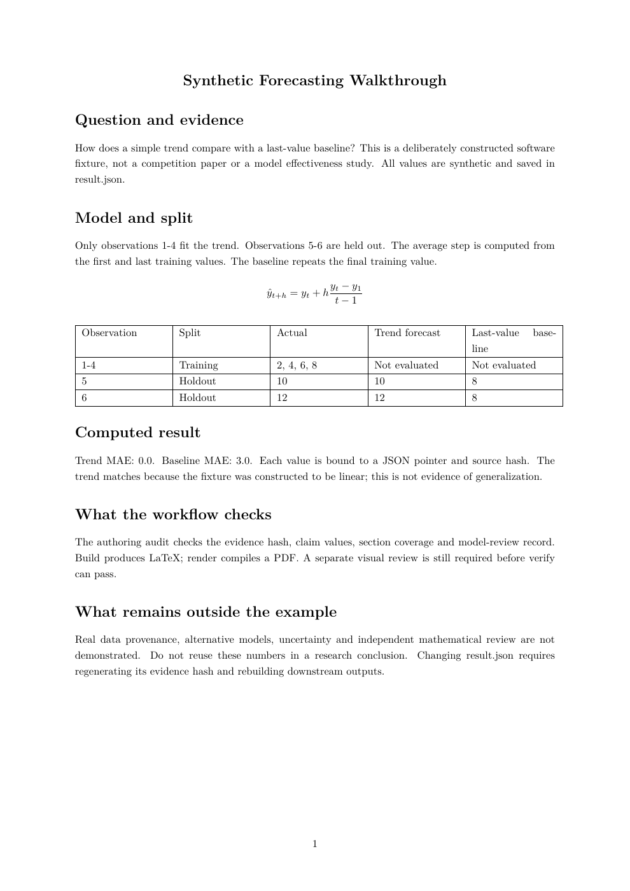
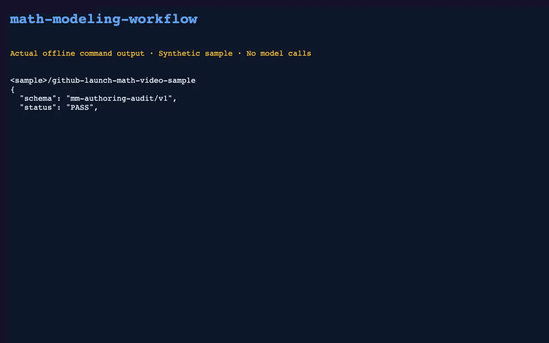

# Mathematical Modeling Workflow

A resumable AI-assisted workflow from problem analysis and derivation to computation, figures and reviewed Word / LaTeX papers.

[中文](README.md) · [Quick start](docs/quickstart.md)


Python 3.10+ · 9 skills · Word / LaTeX · MIT

[View the generated sample PDF](docs/assets/sample-paper.pdf)





Recorded actual synthetic example creation, audit and LaTeX build output.

## Pick an entry

- New problem: [start prompt](prompts/start.md).
- Continue work: [resume prompt](prompts/continue.md).
- Review a draft: [review prompt](prompts/review.md).
- Install stage skills: [installation](docs/install.md).

Prompts and documentation require no installation. Keep your task data and private papers in a separate directory.

## Workflow

Problem → evidence → derivation → computation → validation → figures → writing → final review.

Stage contracts preserve requirements, notation and execution evidence. Chapters, equations and figures link to result files, so upstream changes trigger review of affected conclusions. File checks, mathematical validation and visual review remain separate.

## Run a synthetic example

```sh
git clone https://github.com/luxiaoyu0731/math-modeling-workflow.git
cd math-modeling-workflow
python3 examples/create_showcase.py --destination ../mm-demo
python3 scripts/paper.py --project ../mm-demo audit
python3 scripts/paper.py --project ../mm-demo build --formats latex
```

Use a new destination. This example contains synthetic arithmetic, not a competition paper. See the quick start for PDF/Word export and visual review. `verify` initially fails without the required visual-review record; that is intentional, not proof of a broken build.

<details><summary>Development</summary>

```sh
python3 -B -m unittest discover -s workflow/tests -v
python3 -B -m unittest discover -s tests -v
```

[Review contracts](docs/review-contracts.md) · [Troubleshooting](docs/troubleshooting.md) · [Code review](docs/code-review.md) · [Third-party notices](THIRD_PARTY_NOTICES.md)

</details>

[MIT](LICENSE). Image generation is provided by the user's assistant environment; the repository itself does not purchase model calls.

[Report a bug](https://github.com/luxiaoyu0731/math-modeling-workflow/issues/new?template=bug_report.yml) · [First-use feedback](https://github.com/luxiaoyu0731/math-modeling-workflow/issues/new?template=first_use.yml) · [Starter tasks](.github/CONTRIBUTING.md)

[Versioned releases and artifact verification](docs/releasing.md)
