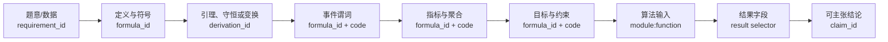

# 公式推导依赖图模板

> 这是推导链，不是装饰性“建模流程图”。每个节点须填 `requirement_id`、`formula_id`、代码函数或输出字段；正式版本按 ImageGen 调用合同生成并核验。

每条边在 `formula_derivation_ledger.csv` 中具有相应的推导步骤、前提和测试映射。若某节点只是在近似、代理或条件模型中成立，节点和边必须显示其边界。
