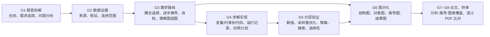

# 数学推理流程模板

```mermaid
flowchart LR
  A["G1 题意拆解\n合同、需求追踪、问题分析"] --> B["G2 数据证据\n来源、假设、适用范围"]
  B --> C["G3 数学路线\n耦合选择、逐步推导、自检、理解图蓝图"]
  C --> D["G4 求解实现\n变量/约束到代码、运行记录、对照计划"]
  D --> E["G5 分层验证\n数值、采样重优化、策略、搜索、适用性"]
  C --> V["G6 图示化\n结构图、对象图、推导图、结果图"]
  E --> V
  V --> F["G7--G8 论文、终审\n分析-推导-图表覆盖、语义 PDF 比对"]
```

图形使用 ImageGen 调用合同；精确标注可叠加，数值几何保持来源可复算。
